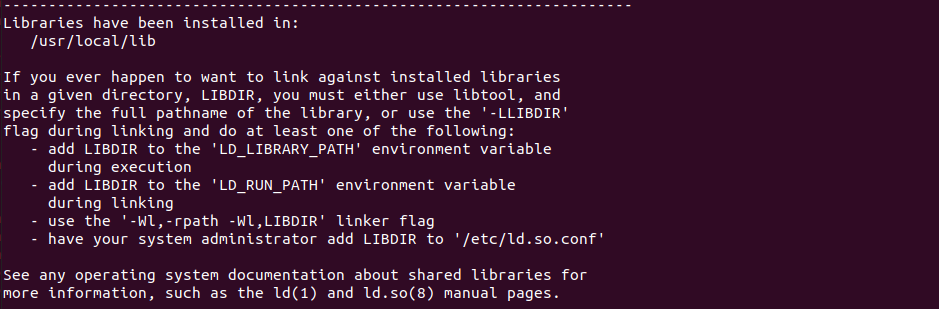
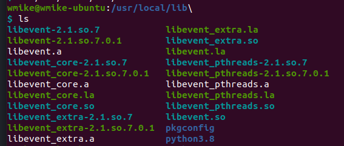
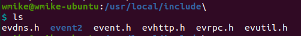
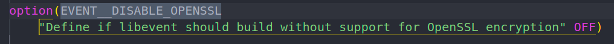
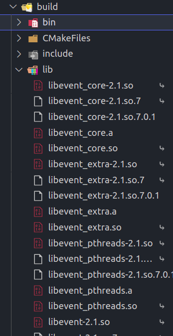
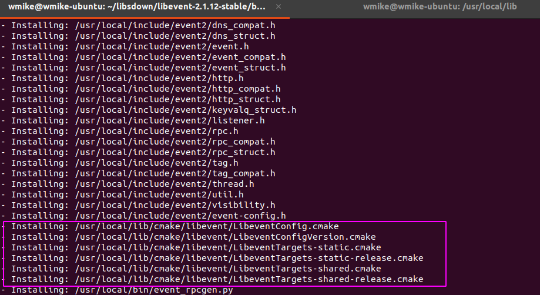

# libevent

## 安装

### AutoConf

安装libevent，

解压下载的 libevent tar包，进入目录

`./configure --disable-openssl`      // disable了openssl

`make` 接着 `sudo make install` ，



安装成功，

libevent的动态链接库被安装到了`/usr/local/lib` 



头文件安装在了 `/usr/local/include`



> 按理说就能够正常使用libevent了啊。

但是在官方的文档中：[libevent/Building.md at master · libevent/libevent · GitHub](https://github.com/libevent/libevent/blob/master/Documentation/Building.md#building-on-unix-cmake)

上边的步骤是在 Autoconf下的。

同级目录下还有 Building on Unix（with cmake）

<a id="caixiang">猜想</a>（因为对CMAKE了解不深入，我觉得可能这个步骤是为了支持CMAKE的find_package() ??）

> [cmake学习（二） 创建库并使用find_package查找包_mylove10086的博客-CSDN博客_clion find_package](https://blog.csdn.net/u014572215/article/details/106105627)

### Building on Unix（with cmake）

接着按 Building on Unix（with cmake）来安装：

根据文档中  CMake Variables 的说明，把 EVENT__DISABLE_OPENSSL变量设置为ON




接着运行 

```shell
$ mkdir build && cd build
$ cmake .. # Default to Unix Makefiles
$ make
$ make verify # Optional
# 应该加一个  make install 命令
```

原来这个步骤，只是通过cmake编译，生成的库（so文件等），存放在Build目录下的lib文件夹。生成的可执行文件在 Build/bin中。



而这些lib下的库文件和Autoconf中安装在 /usr/local/lib 中的一样啊。。。


> 所以 AutoConf就已经在系统中安装了所需要的库了，本来Autoconf根据字面意思不就是自动配置吗，就是把库文件放入 编译器默认查找路径下。
> 
> cmake只是在cmake目录下编译生成这些库。

但是又发现了用cmake生成的make 再 make install 后 有了这些 *.cmake 文件（用于支持cmake find_package()的文件），但是Autoconf中的`make install` 命令并没有安装这些cmake文件。

看来开始的[猜想](#caixiang)还是有部分正确的。。



## 使用

### 如何在CMake-lists中使用 libevent库呢？

https://www.jianshu.com/p/7d5284ca6ae5

[cmake链接libevent的问题_君梦如烟Brian的博客-CSDN博客](https://blog.csdn.net/u012342808/article/details/119464705)

有了 *.cmake文件，就可以通过 find_package() 来自动找到libevent库的位置了，可以在cmake中简单的link了。
