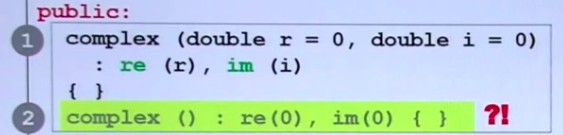
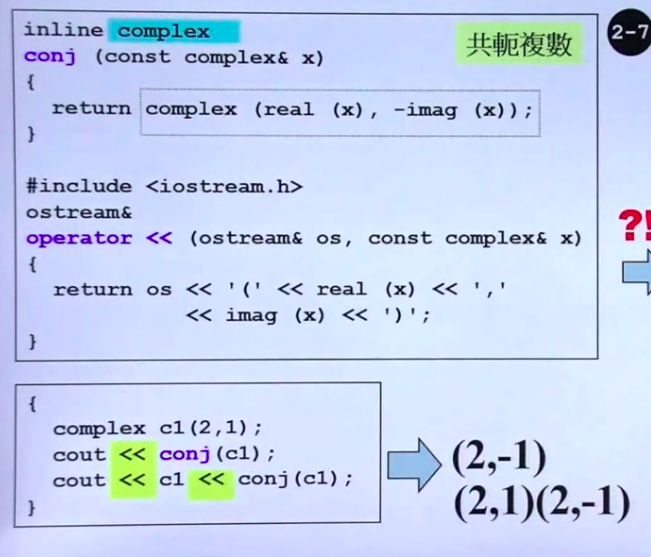
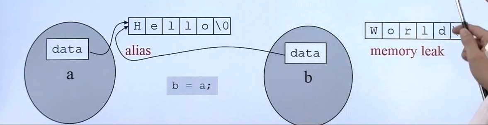
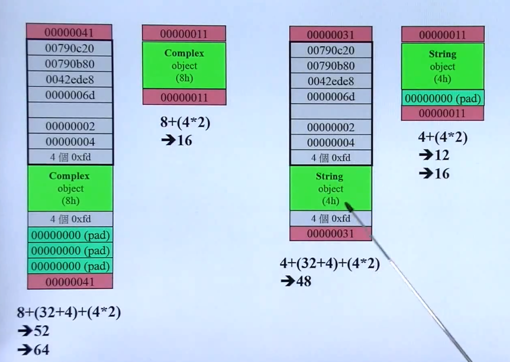
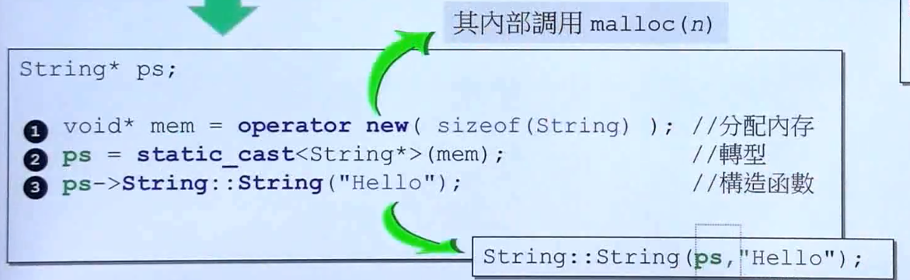
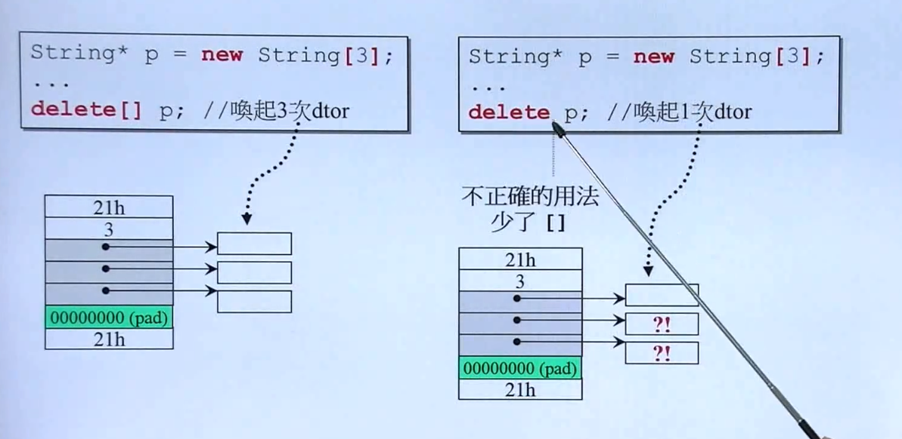

# 面向对象（上）

## 3--5  头文件与类的声明，构造函数，参数的传递与返回值，操作符重载与临时对象

source code:

```cpp
// complex.h
```

```cpp
// test.cpp
```

### C与C++:

C 相当于在一个类中操作： 只有一个 object(变量 + 操作变量的函数)

C++ 类相当于有多个 object(变量 + 操作变量的函数) 

---

### inline函数

定义在类内部的函数，会自动变为inline函数的候选人（系统会根据函数的复杂度来决定其是否为inline函数）

定义在类外部的函数，也可以添加inline关键字，来"成为"inline函数

---

### 初始化列表

构造函数，在初始化列表中赋值，是对类成员的初始化，如果在构造函数内部进行赋值，是对类成员的赋值，一个是初始化，一个是赋值。对应变量的初始化和赋值，显然应该直接进行初始化。

---



这两个构造函数是不能重载的，在`complex c1` 创建Complex对象时,编译器不知道该调用那个构造函数。

----

### 类成员常函数

对于类内部的函数的定义

- 是否会改变类中的成员变量的值。
  
  - 不改变  则定义为 const 函数，即 `void func() const {}`
  
  - 改变 则定义为普通函数

----

### 引用传递还是值传递

> 尽量使用引用 传递参数 和 函数返回

关于函数参数的传递

1. 尽量用引用传递

2. 根据是否要在该函数内对传递的参数作出改变来确定是否要定义为 const 引用

函数的返回值

1. 尽量使用引用返回

2. 什么情况下不能返回引用：**返回的变量是在函数体内定义的，其生命周期随着函数的返回就会消亡**，故返回的是一个已经消亡的变量的引用，是没有意义的。

---

### 友元

同一个类的不同对象object，互为友元（可以直接访问类的私有成员变量）

---

### 操作符重载

#### 成员函数操作符重载

操作符左边的对象为：**调用<操作符重载函数>的对象**，右边的对象为：**<操作符重载函数>的参数**  (自增运算符不能这样理解)

成员函数中，调用成员函数的对象为this （废话。。

**左++ 和 右++**

```cpp
 class Data{
    int a,b;
    Data& operator++()//++ob1
    {
        //先加
        a++;//this->a = this->a +1
        b++;//this->b = this->b +1
        //后使用
        return *this;
    }
    //成员函数 重载后置++  ob1++  (先使用 后加)
    //编译器 默认识别 operator++(a,int) //但是a可以用this代替 从而化简 operator++(int)
    Data& operator++(int)//ob1++
    {
        //先使用(备份加之前的值)
        static Data old=*this;

        //后加
        a++;
        b++;

        //返回备份值
        return old;
    }
 }
```

操作符左边的对象为<操作符重载函数>的**第一个参数**，右边的对象为**第二个参数**

> cout,与cin是两个 object，他们的类是 ostream



## 3--6

> 主要讲了不带指针的类的设计。

### 1. 在类中成员函数的参数设置，返回值设置需要注意的问题

    函数的参数尽量使用引用传递，如果函数体不会改变传递来的引用的值，就加const

    返回值，如果返回的值不是在函数体内创建的变量对象，就设置为引用类型。

    函数是否为const的判断，根据该成员函数是否会改变类的成员变量，如果不改变就加      const


### 2. inline关键字的用法

     类的成员函数在类内部定义默认为inline，在类内声明，类外定义则需要手动添加inline

## 7--9

> 主要讲了成员变量有指针的类的设计。

### 7. 三大函数

由于有了指针类型的成员变量，则必须要重新设计的三个函数 BIG THREE

- 拷贝构造

- 拷贝赋值

- 析构函数

#### 为什么需要重新设计拷贝构造，赋值函数呢？

    如果没有设计这两个函数，编译器会自动有拷贝构造赋值的函数，但是其原理是：

    只是将对象的内存原封不动的按bit来复制给要拷贝构造或者赋值的对象---也就是浅拷贝

    由于类带有指针成员，这样就造成了一个问题：



所以要自己设计一个深拷贝的函数，例如拷贝赋值就必须将b的data原来指向的内存给free了，重新开辟一个内存空间，再将a的data指向的内容拷贝到新开辟的内存空间中。

### 8. 堆，栈，内存管理

#### C++程序的内存分为，栈，堆，静态变量全局变量区，常量区

- 栈：存放函数内部局部变量

- 堆：通过new或malloc，用户自己申请的内存空间，需要自己进行释放

- 静态变量全局变量区：存放静态变量，全局变量

- 常量区：存放常量，不能改变的值

#### memory leak

  一个已经被分配的内存块，但是没有任何指针指向它。那么这块内存就泄露了。

#### 动态分配的内存块（debug模式或其他）



#### new和delete做了什么，分解。所以为什么带指针的类需要重新设计析构函数。

- new： 先分配内存，再调用构造函数



- delete：先调用析构函数，再释放内存

例如，new了一个String对象(带指针)，先分配如图所示的内存块（ps指针指向），再调用String的构造函数，也就是内存块中绿色区域的指针成员变量的内存分配。

delete一个String对象，先调用析构函数，再释放ps指向的内存块。

所以说带有指针的类，如果不自己重新写一个析构函数（用来delete指针变量分配的内存），则ps指向的内存块被释放了（意味着指针成员变量被释放了），但是指针成员变量所指向的内存就memory leak了。

#### array new 和 array delete需要搭配使用的原理

首先，我们知道，delete是先调用析构函数，再释放ps-->内存块。

而array delete，会调用数组长度次的析构函数。

如果用array new，但是普通的delete，就会这样：



造成内存泄漏


## 10--13

### 10. 类模板， 函数模板，其他

类模板与函数模板的不同是：

调用函数模板的时候不需要指明模板的类型是什么，函数模板会根据传入的参数自行推断出类型。

但是使用类模板来创建对象时，就必须指定所参数类型。

### 11. 组合与继承

1. 组合(has-a)

2. 带指针的组合(has-a)

3. 公有继承(is-a)

### 12.虚函数与多态

1. 虚函数：父类可以自己定义，同时子类也可以进行 overwrite 重写

2. 纯虚函数：父类不定义，但是子类必须 overwrite重写

3. 普通函数： overwrite是针对虚函数的术语，普通函数子类不能overwrite.

    

### 13. 委托相关设计

通过委托(带指针的composition)

主要讲了几个设计模式，原型设计模式还有。。
