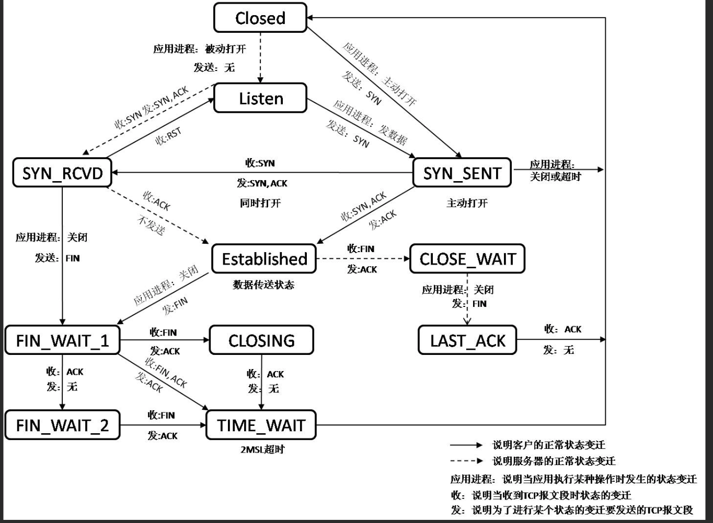
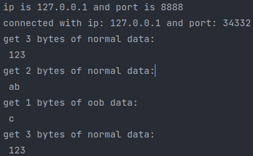
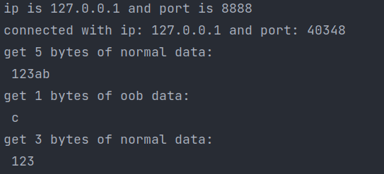

# 第一篇

## TCP/IP 协议族

> 主要将了数据在协议族中是如何传递的（即数据封装和分用）
> 
> 需要了解每个网络层对应的几个重要协议(如ICMP，TCP，UDP，IP，ARP/RARP)

### 数据的封装

> 各层数据------>>  （数据链路层）帧

上层协议是通过封装(对该层的数据报添加头部信息）来使用下层协议提供的服务的。

### 数据的分用

> 帧 -------->> 各层的数据

对于每一层的 数据报 都可以看作 --  [头部] +[数据]

各层协议通过数据报中的头部信息来决定递交给上层哪个协议。

所以每层协议的数据报的[头部信息]中都会有标识[数据部分]是哪个协议的数据。

## IP协议详解

利用 `sudo tcpdump -ntv -i <网卡id> icmp` 进行抓包

`ping www.baidu.com -s 1475`

> 帧的MTU为1500，ICMP数据报文（包含头部信息(8字节)和数据）,IP头部为20字节
> 
> 故`ping www.baidu.com -s 1475` 的一个ip数据包大小为
> 
> [ip头部(20字节)]+[ICMP数据报文([ICMP头部信息(8字节)]+[数据(1475字节)])]=1503
> 
> 故该ip数据报会被分片:
> 
>     [ip头部(20字节)]+[[ICMP头部信息(8字节)]+[数据(1472字节)]]=1500字节
> 
> 和 [ip头部(20字节)]+[数据(3字节)] = 23字节

得到

```cpp
IP (tos 0x0, ttl 64, id 38832, offset 0, flags [+], proto ICMP (1), length 1500)
    172.27.225.161 > 182.61.200.7: ICMP echo request, id 1, seq 1, length 1480
IP (tos 0x0, ttl 64, id 38832, offset 1480, flags [none], proto ICMP (1), length 23)
    172.27.225.161 > 182.61.200.7: ip-proto-1
```

## TCP协议详解

### TCP连接状态总图



### 连接过程

[TCP头部(20字节固定+选项(max: 40字节)] + [数据部分]

TCP报文段头部中SYN标志置1的为同步报文段，同步报文段即使数据部分的大小为0，也要占用一个序号值，也就是说即使对方发送一个数据为空的SYN报文段，返回的ack序列号也要加1.

### 断开连接过程

### 关于 **半关闭连接** 和 FIN ，shutdown（）和close（）

>  个人猜测：(乱想的)
> 
> TCP是区别 有标志位的控制报文和普通的数据报文吧
> 
> 一方（例如A）发送了FIN就代表了已经不再发送数据了，但可以接受数据？？（应该是只能接受对方的控制报文），另一方（B）仍然可以发送数据，但是A接受不到该数据。
> 
> 控制报文不受影响
> 
> 怎么理解，TCP数据运输和close的关系，理解 约定和可以不可以做的关系。

> 总之吧，发送FIN的一方仅仅是表明我不再发送数据了，但是在线路上当然还可以传输双向的数据，但是数据到两端如何处理不是连接管的。
> 
> close和shutdown都会发送FIN
> 
> 最后的理解：
> 
> 主要清楚 两端的接受和发送 与 连接传输线路 是分开的。以及 FIN 和 读写 半毛钱关系都没有吧，应该是 读写和socket的输入输出缓存有关系
> 
> 调用close后，当然可以read 或者 write了，但是本身已经关闭了输入输出缓存（具体不是）
> 
> 而shutdown也发送FIN，但是能否读写要看socket对应的输入输出缓存还能运作吗。

还是不求甚解吧在这块，大概是理解了的。 

其他回答:

- https://www.zhihu.com/question/531028567/answer/2467100695

- [socket中，调用close会发生什么_ganbiaovip的博客-CSDN博客](https://blog.csdn.net/ganbiaovip/article/details/114841651)

### 数据传输过程

- 交互数据（一般携带很少的字节）

客户端与服务器端发送ack确认报文的差异

- 服务器端有延迟确认的机制，即等待有数据输出时，将数据和确认序号放在同一个TCP报文段中发送。
- 客户端没有延迟确认，故接受到数据时会直接发送一段不带数据的ack报文。

原因，客户端数据的输入显然要比客户端程序处理数据输出要慢的多。所以不能等待有数据输入时才一起发送确认报文。

**nagle 算法的原理**

客户端一个按键的输入都要产生一个携带*交互数据*微小的TCP报文段，在上个报文段还未收到服务端确认报文时，客户端完全有可能产生很多个微小TCP报文段，可能造成网络拥塞。

故nagle算法规定了，在TCP连接的任意时刻，通信**双方**最多只能发送一个未被确认的TCP报文段。同时，在等待确认报文的时候，输入的微小数据，可以在输出缓存中堆积从而在输出时形成更长的报文段。这样就提高了发送效率。

---

- 成块数据（一般长度为TCP报文段的最大长度）

# 第二篇

## Linux网络编程基础API

## 高级I/O函数

### 零拷贝函数与普通的IO函数的区别在哪，为什么效率更高

### 各个类别的IO函数总结比较，有哪些IO函数是专门针对socket进行设计的？

### 有哪些零拷贝函数

管道

### in 和 out

sendfile 函数 和 splice 函数都是零拷贝的函数，在两个文件描述符之间直接传递数据（完全在内核中进行），避免了用户的缓冲区和内核的缓冲区的数据交换，从而提高了效率。

关于这两个函数的参数中 in  与 out的文件描述符

  in文件描述符  >>============>> out 文件描述符，

相当于直接在这俩文件描述符中架设了一条管道。

tee函数是在两个文件描述符上进行**拷贝**数据。而sendfile和splice都是**传输**数据，所以in的文件描述符的数据在调用完tee函数后还可以使用。

pipe函数    

数据  >> pipefd[1]  >>=====>> pipefd[0]  >> 数据

## Linux服务器程序规范

> 需要学习系统编程的知识。

### 守护进程 与 其他普通进程有什么区别？

### 文件与用户组用户，进程与用户

## 第八章 重点

### 服务器编程框架，理解服务器机群和单个服务器程序的区别。

### 阻塞IO和非阻塞IO

对于非阻塞IO的系统调用总是返回-1，要通过errno来区别是

- 调用出错

- 事件未发生

所以只有在事件已经发生的情况下去操作非阻塞IO，所以非阻塞IO经常和其他IO通知机制一起使用，如 IO复用，SIGIO信号。

## 同步和异步

区分 I/O模型中的同步和异步，与，半同步/半异步模式中的同步和异步的区别。

这两个同步和异步是不一样的。

一个是对于IO来说的。

一个是对于程序的执行方式来讲的。

## 第九章

>  IO复用

### select

### poll

### epoll

## 第十章

### 信号的基本用法，信号的种类，还有处理信号的方式。

主要就是围绕，sigaction函数和结构体来使用的。

sigaction函数原型：

```cpp
#include <signal.h>
int sigaction(int sig, const struct sigaction *act, struct sigaction *oact);
```

`sig` : 信号类型: (SIGINT, SIGHUP......)

`act` : 接收到信号的action

`oact` : 该信号之前的action

结构体 sigaction (不是源码，主要部分):

```cpp
struct sigaction
{
    _sighandler_t sa_handler;    
    _sigset_t sa_mask;
    int sa_flags;        
}
```

`sa_handler` 为信号处理函数。

其类型是 `_sighandler_t` ，原型为：

```cpp
typedef void (*__sighandle_t) (int );
```

`sa_mask`为进程的信号掩码，也就是在处理该信号时要屏蔽的信号种类。

其类型是_sigset_t，叫信号集，原型:

```cpp
typedef struct{
    unsigned long int __val[_SIGSET_NWORDS];
}__sigset_t
```

该结构体中的 unsigned long int型数组的每个元素的每一位代表一种信号。

有一系列的修改信号集的位操作函数：

```cpp
int sigemptyset(sigset_t *_set)                // 清空信号集
int sigfillset(sigset_t *_set)                 //设置所有信号
int sigaddset(sigset_t *_set, int _signo)
int sigdelset(sigset_t *_set, int _signo)
int sigismember(sigset_t *_set, int _signo)
```

`sa_flags` : 由于接受信号后会执行信号处理函数(sa_handler指定的),所以会打乱原先的程序执行过程，所以有几个sa_flags 来控制程序收到信号后的执行流程。

> 具体也不是很清楚，还没用到，有些flag和系统调用中断有关。

### 如何统一事件源（IO，信号，）

利用管道 pipe    已知 pipefd[1] ====>>> pipefd[0]

所以信号处理函数中通过 往pipefd[1] 中写入数据，就可以在 pipefd[0]中接收到，那么pipefd[0] 就会有可读事件的发生。

所以可以利用IO复用，将pipefd[0] 注册到IO复用的文件描述符事件监测表中，就可以统一事件源了。

### 到底是如何使用select 来接收 oob数据的，结合第十章利用信号处理带外数据，和第五章的发送带外数据的客户端程序。

代码9-1，通过第五章发送带外数据的客户端来进行测试：

发现了一个很奇怪的问题，运行多次的结果不一样。

第一次：



第二次：



客户端发送数据的顺序如下：
“123” >>>normal

"abc">>>oob

“123” >>>normal

**可能是**因为再第一次发送normal数据后，服务端缓存刚有数据，select就返回了，此时只能检测有可读事件，输出 "123"

而另一种情况是，在服务端接受到带外数据后，服务端select才返回，这时就同时检测到了可读事件和异常事件，可读事件输出 "123ab"  异常事件输出 “c”

> 只是猜测，关于带外数据，感觉还是没有理解透彻，为什么带外数据会把正常数据给分割掉，recv函数读取有带外数据的缓存是如何读取的。分别有带外数据缓存和普通数据缓存吗


## 第十一章

介绍了三种定时器的数据结构：

1. 链表

2. 时间轮

3. 最小堆
