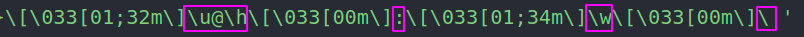
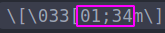

# 基本命令

## grep

## ls 全命令

## ps 检查进程

## tar

## 

# 基础知识

## 服务 (systemctl)

## su su - sudo 环境变量

[linux下 su &amp; su - &amp; sudo命令对环境变量造成的影响 &amp; 设置环境变量 - 会打架的程序员不是好客服 - 博客园](https://www.cnblogs.com/doggod/p/13391811.html#:~:text=%E4%BD%BF%E7%94%A8su%E4%B8%8D%E5%8A%A0%E4%BB%BB%E4%BD%95%E5%8F%82%E6%95%B0%EF%BC%8C%E9%BB%98%E8%AE%A4%E6%98%AF%E5%88%87%E6%8D%A2%E5%88%B0root%E7%94%A8%E6%88%B7%EF%BC%8C%E4%B8%8D%E5%8F%98%E7%8E%AF%E5%A2%83%E5%8F%98%E9%87%8F%20%E4%BD%BF%E7%94%A8su,%E2%80%93%20%E6%99%AE%E9%80%9A%E7%94%A8%E6%88%B7%E5%88%87%E6%8D%A2%E5%88%B0root%E7%94%A8%E6%88%B7%EF%BC%8C%E6%94%B9%E5%8F%98%E7%8E%AF%E5%A2%83%E5%8F%98%E9%87%8F)

# 配置appearance

## ubuntu 终端 显示，颜色等配置

在 ~/.bashrc 配置

PS1变量即 prompt显示样式的设置：



圈起的是命令提示符号（如下），或者就是文本，

> ```objectivec
> \d ：#代表日期，格式为weekday month date，例如："Mon Aug 1"   
> \H ：#完整的主机名称。   
> \h ：#仅取主机的第一个名字。 
> \t ：#显示时间为24小时格式，如：HH：MM：SS   
> \T ：#显示时间为12小时格式   
> \A ：#显示时间为24小时格式：HH：MM   
> \u ：#当前用户的账号名称   
> \v ：#BASH的版本信息   
> \w ：#完整的工作目录名称。家目录会以 ~代替   
> \W ：#利用basename取得工作目录名称，所以只会列出最后一个目录 
> \# ：#下达的第几个命令   
> \$ ：#提示字符，如果是root时，提示符为：# ，普通用户则为：$  
> ```

颜色的配置:

每个 命令提示符号或者文本前都有 个样式配置 

配置的就是这几个数字，用分号隔开:



前景--字体

```cpp
　　0 重新设置属性到缺省设置     
　　1 设置粗体
　　2 设置一半亮度(模拟彩色显示器的颜色)
　　4 设置下划线(模拟彩色显示器的颜色)
　　5 设置闪烁
　　7 设置反向图象
　　22 设置一般密度
　　24 关闭下划线
　　25 关闭闪烁
　　27 关闭反向图象
　　30 设置黑色前景
　　31 设置红色前景
　　32 设置绿色前景
　　33 设置棕色前景
　　34 设置蓝色前景
　　35 设置紫色前景
　　36 设置青色前景
　　37 设置白色前景
　　38 在缺省的前景颜色上设置下划线
　　39 在缺省的前景颜色上关闭下划线
　　40 设置黑色背景
　　41 设置红色背景
　　42 设置绿色背景
　　43 设置棕色背景
　　44 设置蓝色背景
　　45 设置紫色背景
　　46 设置青色背景
　　47 设置白色背景
```
