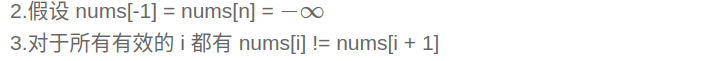
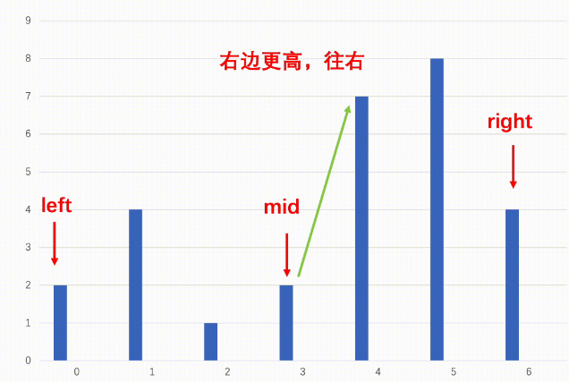
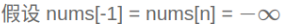
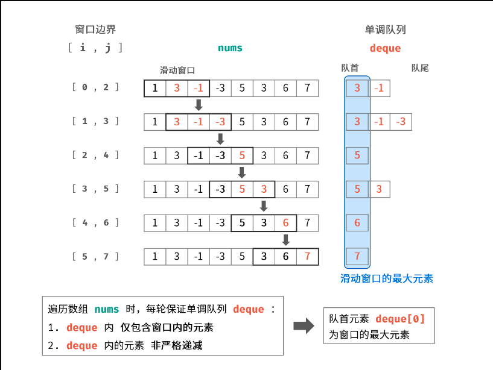
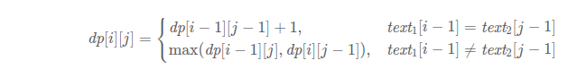
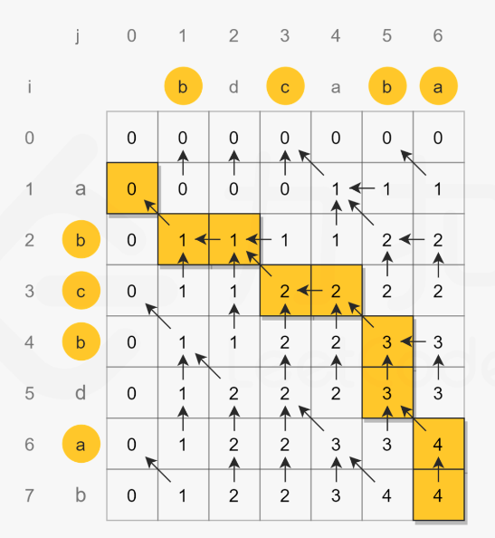

## 二叉树的遍历

掌握使用stack，进行非递归的二叉树遍历，主要理解二叉树遍历的访问顺序是一样的，只是在节点访问几次后输出的问题。

前序，访问到一次就输出。

中序，访问到两次输出。

后序，访问到三次输出。

# 牛客

## 2022年 11月 02日 星期三 10:16:36 CST

### BM95 分糖果问题

 [分糖果问题_牛客题霸_牛客网](https://www.nowcoder.com/practice/76039109dd0b47e994c08d8319faa352?tpId=295&tqId=1008104&ru=/exam/oj&qru=/ta/format-top101/question-ranking&sourceUrl=%2Fexam%2Foj)

**前提：**

        左条件： 取任意相邻节点左A右B，若 A < B 则分得糖果的数量, numA < numB

        右条件： 同理，若 A > B 则分得的糖果 numA > numB

        题目的要求是，分糖果的结果，每个节点都满足上述两个条件。

        容易理解的是从左向右遍历一遍后，能够使所有节点符合左条件

        先不讨论为什么接着需要从右往左开始遍历，来去满足右条件，直接讨论从右往左遍历的合理性

**右遍历方法：**

        从右往左遍历的方式为：取任意相邻左A右B，经过左遍历后，为numA与numB

        在右遍历的过程中，如果A > B,而numA <= numB，则numA = numB+1,否则不变

**理解：**

        首先从左向右已经符合了左条件了，那么只要证明按给出的方式从右往左遍历（必然满足右条件）后，不会破坏左条件即可。

        从右往左遍历的过程中，任意两个节点左A右B，假设A的左边为C，

        C --- A --- B

1.   C < A，那么经过左遍历后必然numC < numA
   
   1. A > B, 根据右遍历的方法，
      
      - 如果numA < numB, numA = numB+1, 则numA仍然满足 numA > numC,故没有破坏左条件。
      
      - numA >= numB, numA值不变，故仍满足左条件
   
   2. A <= B, numA的值不变，仍然满足左条件

2. C > A, 则经过左遍历后,A的值必为1，C的值 >= 1，即numC >= numA
   
   - A > B, numA = numB+1, 此时可能不满足 numC >= numA,如果 numC < numA了，就会在下一轮循环中根据右遍历的方法，使得 numC = numA+1, 仍然会使numC > numA。

其实 C > A 的情况不用考虑，C > A不在左条件的判断范围内，而是在右条件的判断范围下，而右遍历后必然满足右条件。

```cpp
int candy(vector<int> &arr)
{
    int size = arr.size();
    vector<int> res(size, 1);
    for (int i = 1; i < size; ++i)
    {
        if (arr[i - 1] < arr[i])
        {
            res[i] = res[i - 1] + 1;
        }
    }
    for (int i = size - 2; i >= 0; --i)
    {
        if (arr[i] > arr[i + 1] && res[i] <= res[i + 1])
        {
            res[i] = res[i + 1] + 1;
        }
    }
    int num = 0;
    for (const auto i : res)
    {
        num += i;
    }
    return num;
}
```

### BM96 主持人调度（二）

[主持人调度（二）_牛客题霸_牛客网](https://www.nowcoder.com/practice/4edf6e6d01554870a12f218c94e8a299?tpId=295&tqId=1008104&ru=%2Fexam%2Foj&qru=%2Fta%2Fformat-top101%2Fquestion-ranking&sourceUrl=%252Fexam%252Foj)

1. 开始时间添加到一个vector中，排序。

2. 结束时间添加到一个vector中，排序。

3. 遍历开始时间，
   
   - 显然最差的情况就是每个活动都有一个主持人，也就是每次循环都要加一个主持人。
   
   - 但是，有一种情况很好理解：就是发现当前循环的开始时间的**活动**比当前指向的结束时间的**活动**晚，那直接让这个结束活动的主持跑去主持当前循环的活动就好了。所以这种情况就不需要添加主持人。那么就指向下一个结束时间的活动。
   
   - 其余情况，主持人保持++就好。

```cpp
int minmumNumberOfHost(int n, vector<vector<int>> &startEnd)
{
    vector<int> start;
    vector<int> end;
    for (const auto time : startEnd)
    {
        start.push_back(time[0]);
        end.push_back(time[1]);
    }
    sort(start.begin(), start.end());
    sort(end.begin(), end.end());
    int num = 0;
    int endindex = 0;
    for (int i = 0; i < n; ++i)
    {
        if (start[i] >= end[endindex])
        {
            ++endindex;
        }
        else
        {
            ++num;
        }
    }
    return num;
}
```

> 两道贪心算法的题，都是似懂非懂的。但是能写出代码就行，别理解太深入了，大不了背下来也行。

### BM97 旋转数组

> 明明是做过的题目，但是还是给忘了，翻转也太巧妙了，记不住啊。。。


1. 全部翻转

2. 前offset位翻转

3. 后边的翻转

```cpp
    vector<int> solve(int n, int m, vector<int>& a) {
        int offset = m % n;
        if (!offset) return a;
        reverse(a.begin(), a.end());
        reverse(a.begin(), a.begin() + offset);
        reverse(a.begin() + offset, a.end());
        return a;
    }
```

## 2022/11/03 周四 13:55:03.73

### BM3 链表中的节点每k个一组翻转

[链表中的节点每k个一组翻转_牛客题霸_牛客网](https://www.nowcoder.com/practice/b49c3dc907814e9bbfa8437c251b028e?tpId=295&tqId=722&ru=/exam/oj&qru=/ta/format-top101/question-ranking&sourceUrl=%2Fexam%2Foj)

2022/11/03 周四 15:03:23.72

> male, 做了一个小时，还是没做出来，这还是看了BM1和2的前提下，不想做了，草。链表题咋这么sb呢。。。不如直接看答案呢，还省时间。在leetcode是道hard题。。怪不得，心态别崩就好

[力扣题解](https://leetcode.cn/problems/reverse-nodes-in-k-group/solutions/10416/tu-jie-kge-yi-zu-fan-zhuan-lian-biao-by-user7208t/)

按题解写的代码, 注释已经写明白了。。。

```cpp
ListNode *reverse(ListNode *head) {
    ListNode *prev = head;
    ListNode *cur = prev->next;

    while(cur){
        ListNode *nextNode = cur->next;
        cur->next = prev;

        prev = cur;
        cur = nextNode;
    }
    return prev;
}

ListNode *reverseKGroup(ListNode *head, int k) {
    ListNode *dummy = new ListNode(-1);
    dummy->next = head;
    ListNode *seqHead = dummy->next, *seqEnd = dummy;
    ListNode *nextSeqHead = nullptr, *preSeqNode = dummy;

    while (seqEnd->next) {
        seqEnd = preSeqNode;
        for (int i = 0; i < k && seqEnd; ++i) {
            seqEnd = seqEnd->next;
        }
        if (!seqEnd) break;
        nextSeqHead = seqEnd->next;
        seqEnd->next = nullptr;

        // 翻转长度为k的序列
        // 翻转后 原序列的 seqHead 成为尾部， seqEnd成为头部
        // 将 preSeqNode->next 指向 头部(seqEnd)
        // 尾部(seqHead)的next 指向nextSeqHead
        preSeqNode->next = reverse(seqHead);
        seqHead->next = nextSeqHead;
        // 到这里完成一次k序列的翻转

        // 为待翻转序列做准备，所以这里的 preSeqNode 和 seqHead都是对于 待翻转序列的
        preSeqNode = seqHead;
        seqHead = nextSeqHead;
    }
    head = dummy->next;
    delete dummy;
    return head;
}
```

### BM4 合并两个排序的链表

[合并两个排序的链表_牛客题霸_牛客网](https://www.nowcoder.com/practice/d8b6b4358f774294a89de2a6ac4d9337?tpId=295&tqId=23267&ru=/exam/oj&qru=/ta/format-top101/question-ranking&sourceUrl=%2Fexam%2Foj)

简单题，用了新建一个链表，而不是在链表1上插入节点。

## 2022年 11月 04日 星期五 17:37:36 CST

### BM19 寻找峰值

[寻找峰值_牛客题霸_牛客网](https://www.nowcoder.com/practice/fcf87540c4f347bcb4cf720b5b350c76?tpId=295&tqId=2227748&ru=/exam/oj&qru=/ta/format-top101/question-ranking&sourceUrl=%2Fexam%2Foj)

关键思路：峰值一定存在，只要往高的地方爬坡就一定能找到峰值。

根据题目的假设：



数组中必定存在峰值，因为无非就是几种情况：

1. 单调增:则峰值在右端点

2. 单调减:峰值在左端点

3. 中间有起伏：那么除了端点以外必定有峰值

4. 两端中间只有一个波谷，那么峰值就在两端

那么使用二分法，如果mid左右有比mid处的值更大的值，那么就将搜索区间换为更大的值的那个区间：



这样相当于缩短了区间，但是该区间内必定有峰值，因为相当于mid就是该区间的 -1 或者 n 那个位置的值，所以还是符合之前的结论的。



所以说，这样能够不断地缩小区间，如果最后begin和end 到一个位置的时候就是最短的区间，也就是峰值的位置了，因为区间内必定存在峰值，而区间只剩一个元素了，那不就是峰值吗。

```cpp
int findPeakElement(vector<int> &nums) {
    // write code here4
    int begin = 0, end = nums.size() - 1;
    int mid=0;
    // 记住， mid 总是靠左的，所以最终结果只能是 begin == end，退出循环
    while (begin < end){
        mid = (begin + end)/2; // 因为 begin < end， 所以 mid+1 必不可能越界
        if(nums[mid] < nums[mid+1]){
            begin = mid + 1;
        }else{
            end = mid;
        }
    }
    return begin;
}
```

### BM20 数组中的逆序对

[数组中的逆序对_牛客题霸_牛客网](https://www.nowcoder.com/practice/96bd6684e04a44eb80e6a68efc0ec6c5?tpId=295&tqId=2227748&ru=%2Fexam%2Foj&qru=%2Fta%2Fformat-top101%2Fquestion-ranking&sourceUrl=%2Fexam%2Foj)

两个关键点：

1. 利用了归并排序的思想

2. 如果两个区间为[4, 3] 和[1, 2]  
   那么逆序数为(4,1),(4,2),(3,1),(3,2)，同样的如果区间变为有序，比如[3,4] 和 [1,2]的结果是一样的，也就是说区间有序和无序结果是一样的。  
   但是如果区间有序会有什么好处吗？当然，如果区间有序，比如[3,4] 和 [1,2]  
   如果3 > 1, 显然3后面的所有数都是大于1， 这里为 4 > 1, 明白其中的奥秘了吧。所以我们可以在合并的时候利用这个规则。
   
   > 可能会疑问，这不是漏掉了，[4,3]这个逆序对了吗，但是在归并排序的上一步，[4] 和 [3] 合并中，就得出了 [4,3]这一逆序对了。

 学习一下这种写法，赋值的写法：

```cpp
void merge(vector<int> &data, vector<int> &tmp, int begin, int end, int mid, int &res) {
    // 两个vec 一个 [begin, mid]  一个 [mid+1, end]
    int i = begin, j = mid + 1, k = 0;
    while (i <= mid && j <= end) {
        if (data[i] > data[j]) {
            tmp[k++] = data[j++];
            res += (mid - i + 1);
        } else {
            tmp[k++] = data[i++];
        }
    }
    while (i <= mid) {
        tmp[k++] = data[i++];
    }
    while (j <= end) {
        tmp[k++] = data[j++];
    }
    i = begin, k = 0;
    while (i <= end) {
        data[i++] = tmp[k++];
    }
}
```

一个易错点：

    就是res应该为 unsigned int , 因为res的值可能会很大，如果为int类型，在增加的过程中可能变为负数。

## 2022年 11月 05日 星期六 10:37:25 CST

### BM26 求二叉树的层序遍历

[求二叉树的层序遍历_牛客题霸_牛客网](https://www.nowcoder.com/practice/04a5560e43e24e9db4595865dc9c63a3?tpId=295&tqId=644&ru=/exam/oj&qru=/ta/format-top101/question-ranking&sourceUrl=%2Fexam%2Foj)

wssb

..

就是普通的（不分割层次的）层次遍历，再增加一个条件,


关键点：就是每次循环中，队列的长度就是该层节点的个数。

```cpp
vector<vector<int> > levelOrder(TreeNode* root) {
        // write code here
        if (!root) return {};
        queue<TreeNode* > nodeque;
        nodeque.push(root);
        vector<vector<int>> res;
        while (!nodeque.empty()) {
            vector<int> layer;
            int size = nodeque.size();
            while (size--) {
                root = nodeque.front();
                layer.push_back(root->val);
                if (root->left) nodeque.push(root->left);
                if (root->right) nodeque.push(root->right);
                nodeque.pop();
            }
            res.push_back(layer);
        }
        return res;
    }
```

如果自己画一遍普通的层次遍历的整个流程的话，应该能想到吧。。。

## 2022年 11月 07日 星期一 10:40:07 CST

### BM45 滑动窗口的最大值

[滑动窗口的最大值_牛客题霸_牛客网](https://www.nowcoder.com/practice/1624bc35a45c42c0bc17d17fa0cba788?tpId=295&tqId=23458&ru=/exam/oj&qru=/ta/format-top101/question-ranking&sourceUrl=%2Fexam%2Foj)

- **方法一**

    自己想出来的，半暴力求解：

```cpp
    vector<int> maxInWindows(const vector<int>& num, unsigned int size) {
        if(!size) return {};

        int maxIndex = 0, max = -1e5;
        int winBegin = 0, winEnd = size - 1;
        int numSize = num.size();

        vector<int> res{};
        while (winEnd < numSize) {
            if (!(maxIndex <= winEnd && maxIndex >= winBegin && max > num[winEnd])) {
                max = num[winBegin];
                for (int i = winBegin + 1; i <= winEnd; ++i) {
                    if (num[i] > max) {
                        max = num[i];
                        maxIndex = i;
                    }
                }
            }
            res.push_back(max);
            ++winBegin;
            ++winEnd;
        }
        return res;
    }
```

- **方法二 优先队列（大根堆）**

- **方法三  单调队列**

关键点

1. 第一个窗口的初始化

2. 一个窗口的最大值前的所有数都是可以忽略的，因为只要窗口没有向右移动到最大值处，就不会对最大值产生影响啊，所以需要考虑的只有右边新增的值，只有右边新增的值会对最大值产生影响



## 2022年 11月 08日 星期二 14:25:27 CST

### BM53 缺失的第一个正整数

**方法一**：

1. 根据数组建立哈希表

2. 从1开始遍历，返回第一个未出现在哈希表中的正整数

**方法二：**

空间复杂度O(1) 

**关键**： 

长度为n的数组中，出现的最小正整数只有两种可能：

1. 1~n

2. n+1

所以可以利用数组自带的下标进行算法的实现。

1. 将数组中的数字都当做下标，由于数组中存在 <= 0 的数字，所以这些数字（下标）设置为大于n的数字。

2. 遍历数组，如果出现范围在 [1,n] 的数字，就将对应下标的数字改为负数，这样就起到了标记的作用，标记该下标在数组中出现过。
   
   - 应该判断数字的绝对值，因为可能在遍历到之前，该位置的数字就被标记过了。

3. 最后再次遍历数组，第一次出现正数的下标位置即为数组中未出现的最小正整数。

## 2022年 11月 10日 星期四 14:50:32 CST

### BM64 最小花费爬楼梯

[最小花费爬楼梯_牛客题霸_牛客网](https://www.nowcoder.com/practice/6fe0302a058a4e4a834ee44af88435c7?tpId=295&tqId=2366451&ru=/exam/oj&qru=/ta/format-top101/question-ranking&sourceUrl=%2Fexam%2Foj)


## 2022年 11月 10日 星期四 19:41:34 CST

### BM65 最长公共子序列(二) (需要输出该最长子序列)

使用动态规划，状态转移方程如下：

dp[i][j] 的含义是： 字符串1 的前 i 项 和 字符串2 的 前 j 项的最长子序列。


dp数组的初始化：

    显然 dp[0][0] dp[1][0] dp[0][1] 的 值都为0






但是该题不只要最长子序列的长度，还要输出该序列，通过观察上图，可以得到如何输出该序列。

# 力扣

## 2022年 11月 07日 星期一 10:16:18 CST

### 39组合总和

[力扣](https://leetcode.cn/problems/combination-sum/)

> 同样使用回溯法，但是要注意区分这道题和求全排列那道题的区别。
> 
> 本质上是  排列和组合的不同。组合是不论顺序的，排列是顺序不同就算不同的排列

     
